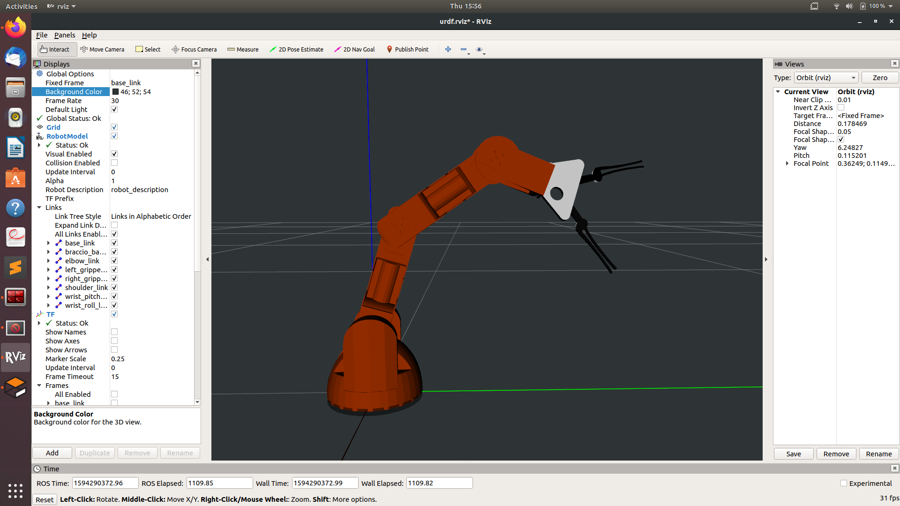

# RoManOV
<!--<h4>Object picking and stowing with a 6-DOF KUKA KR210  anthropomorphic articulated robotic manipulator using ROS</h4>-->

  

<b>Team RoManOV</b>
 
<a href="mailto:f20180590@goa.bits-pilani.ac.in" target="_top">f20180590@goa.bits-pilani.ac.in</a>

------------

### Contents
1. [Introduction](#1.0)
2. [Environment Setup](#2.0)
3. [Theoretical Background](#3.0)
4. [Design Requirements](#4.0)
5. [Design Implementation](#5.0)
7. [Testing and Review](#6.0)

------------

### Abbreviations

* **DOF** &nbsp;&nbsp;&nbsp;&nbsp;&nbsp; [Degrees Of Freedom](https://en.wikipedia.org/wiki/Degrees_of_freedom_(mechanics))
* **ROS** &nbsp;&nbsp;&nbsp;&nbsp;&nbsp; [Robot Operating System](http://www.ros.org/)
* **EE** &nbsp;&nbsp;&nbsp;&nbsp;&nbsp;&nbsp;&nbsp;&nbsp; [End-Effector](https://en.wikipedia.org/wiki/Robot_end_effector)
* **WC** &nbsp;&nbsp;&nbsp;&nbsp;&nbsp;&nbsp;&nbsp; [Wrist Center](https://www.youtube.com/watch?v=V_6diIcQl0U)
* **DH**&nbsp;&nbsp;&nbsp;&nbsp;&nbsp;&nbsp;&nbsp;&nbsp;&nbsp;[Denavit–Hartenberg](https://en.wikipedia.org/wiki/Denavit%E2%80%93Hartenberg_parameters)
* **FK** &nbsp;&nbsp;&nbsp;&nbsp;&nbsp;&nbsp;&nbsp;&nbsp; [Forward Kinematics](https://en.wikipedia.org/wiki/Forward_kinematics)
* **IK** &nbsp;&nbsp;&nbsp;&nbsp;&nbsp;&nbsp;&nbsp;&nbsp;&nbsp; [Inverse Kinematics](https://en.wikipedia.org/wiki/Inverse_kinematics)
* **RRR** &nbsp;&nbsp;&nbsp;&nbsp;&nbsp; [Revolute Revolute Revolute](http://www.roboticsbible.com/robot-links-and-joints.html)
* **URDF** &nbsp;&nbsp;&nbsp; [Unified Robot Description Format](http://wiki.ros.org/urdf)

------------

### 1. Introduction
This project originated from one of the final projects we had kept for a summer term course conducted by the project founding members. You may refer to [this](https://github.com/abhidxt299/QSTP-Introduction-to-Mechatronics) repository for further details on the course conducted.

	
<b>Fig. 1.1&nbsp;&nbsp;The current model of RoManOV developed and simulated in Gazebo</b>

##### Objective
The goal here is to build a robotic arm that can autonomously recognise, pick and place objects and ultimately perform complex tasks like playing a game of chess using Convolutional Neural Networks, Deep Learning and Computer Vision.

------------

<!--

   2. Environment Setup<a href="#top">Back to Top</a>

-->
### 2. Environment Setup
The project uses [ROS Kinetic Kame](http://wiki.ros.org/kinetic) running on [Ubuntu 16.04 LTS (Xenial Xerus)](http://releases.ubuntu.com/16.04/).

The following tools are planning to be used for simulation and motion planning:

* [Gazebo](http://gazebosim.org/): a physics based 3D simulator extensively used in the robotics world
* [RViz](http://wiki.ros.org/rviz): a 3D visualizer for sensor data analysis, and robot state visualization
* [MoveIt!](http://moveit.ros.org/): a ROS based software framework for motion planning, kinematics and robot control
* [MATLAB & Simulink](https://www.mathworks.com): a multi-paradigm numerical computing environment and proprietary programming language

We'll update the README.md file on the Environment setup, once the setup is done. For MATLAB & Simulink simulations, you may refer to [this](github.com/abhidxt299/RoManOV_Simulation).

------------

<!--

3. Theoretical Background<a href="#top">Back to Top</a>

-->
### 3. Theoretical Background
The following theoretical concepts will be used in this project:

* Generalized Coordinates and Degrees of Freedom
* Rotation matrices and composition of rotations
* Euler angles and Euler theorem
* Homogeneous transforms
* Denavit–Hartenberg parameters
* Forward and Inverse Kinematics
* Computer Vision
* Deep Learning
* Object Learning
* Applications using Neural Networks
* Contrast Limited Adaptive Histogram Equalisation (CLAHE)
* Stockfish

#### 3.1 Serial Manipulators
[Serial manipulators](https://en.wikipedia.org/wiki/Serial_manipulator) are robots composed of an assembly of links connected by joints (a [Kinematic Chain](https://en.wikipedia.org/wiki/Kinematic_chain)), and the most common types of robots in industry.

##### Generalized Coordinates
Generalized coordinates are parameters that are used to uniquely describe the instantaneous dynamical configuration of a [rigid](https://en.wikipedia.org/wiki/Rigid_body) [multi-body system](https://en.wikipedia.org/wiki/Multibody_system) relative to some reference configuration. In the robotics of serial manipulators, they are used to define the *configuration space* or *joint space*, which refers to the set of all possible configurations a manipulator may have.

##### Degrees of Freedom
The [degree of freedom (DOF)](https://en.wikipedia.org/wiki/Degrees_of_freedom_(mechanics)) of a rigid body or mechanical system is the number of independent parameters or coordinates that fully define its configuration in free space.

Common DOFs:

* *6*: coordinates required to fully describe the configuration of a rigid body in 3D free space
* *12*: coordinates required to fully describe simultaneously the configuration of two separate rigid bodies in 3D free space
* *7*: coordinates required to fully describe the configuration of two rigid bodies in 3D free space connected by a joint

 
<b>Fig. 3.1&nbsp;&nbsp;Geometry of a 3-DOF anthropomorphic robot</b>
 
[Source: Narong Aphiratsakun. AIT]

The serial manipulator shown in figure 3.1  has n=3 joints: each a [revolute](https://en.wikipedia.org/wiki/Revolute_joint) with 1-DOF. Each joint connects with two links, making the total number of links, n+1 = 4, including the fixed base link.

Therefore, the total number of DOF for any serial manipulator with *three* 1-DOF joints is:

&nbsp;

*Note:* The DOF of a serial manipulator with only [revolute](https://en.wikipedia.org/wiki/Revolute_joint) and/or [prismatic](https://en.wikipedia.org/wiki/Prismatic_joint) joints is *always* equal to the number of its joints, except when both ends of the manipulator are fixed (closed chain linkage).

##### Workspace
The *workspace* of a robotic manipulator is defined as the set of points that can be reached by its [end-effector](https://en.wikipedia.org/wiki/Robot_end_effector) [2]. In other words, it is simply the 3D space in which the robot mechanism works.

 
<b>Fig. 3.2&nbsp;&nbsp;&nbsp;Workspaces of 3-DOF SCARA and anthropomorphic manipulators</b>
 
[Source: Federica.EU]

Figure 3.2 shows two types of serial manipulators, [SCARA](https://en.wikipedia.org/wiki/SCARA) and [Anthropomorphic](https://en.wikipedia.org/wiki/SCARA) with their associated workspaces. Figure 3.1 also shows the workspace of the 3-DOF manipulator from a top and side perspective. 

It is important to note that no kinematic solution exists for the manipulator's configuration or joint space for any desired end-effector position outside of the workspace.

##### Spherical Wrist
A *spherical wrist* of a robotic manipulator is designed by arranging its last three revolute joints such that their axes of rotations intersect at a common point, referred to as the *wrist center*.

 
<b>Fig. 3.3&nbsp;&nbsp;Difference between a spherical and non-spherical wrist</b>
 
[Source: Khaled Elashry, ResearchGate]

Figure 3.3 shows the difference between a spherical and non-spherical wrist. In 3.3 (a), joint axes of rotations A, B, C all intersect at the wrist center, whereas, in 3.3(b), the wrist center is non-existent. Physically speaking, a six DOF serial manipulator like the one in figure 3.3 would use the first three joints to control the position of the wrist center while the last three joints (spherical wrist) would orient the end effector as needed, as in a human arm.

The spherical wrist is an important design characteristic in anthropomorphic manipulators which simplifies their kinematic analysis, as demonstrated in section 5. 

#### 3.2 Rotation of Coordinate Frames
Rotation matrices are a means of *expressing* a vector in one coordinate frame in terms of some other coordinate frame.

 
<b>Fig. 3.4&nbsp;&nbsp;A 2D geometric rotation between coordinate frames A and B</b>
 

In figure 3.2, Point **P** is expressed with vector **u** relative to coordinate *frame B*. The objective is to express point **P** with vector **v** relative to coordinate *frame A*. The basis vectors of **v**, **vx** and **vy** can be expressed in terms of the basis vectors of **u**, **ux** and **uy**  as follows:

where unit vectors of *frame A*, **ax** and **ay** are expressed in terms of unit vectors of *frame B*, **bx** and **by** as follows:

Substituting (2) in (1) and solving for the dot products yields the following equation:

where the first term on the right-hand side is the **2D Rotation Matrix**, denoted in this case as **<i>abR</i>**. Any point on coordinate *frame B* multiplied by <i>abR</i> will project it onto *frame A*. In other words, to express a vector **u** on some *frame B* as a vector **v** on a different *frame A*, **u** is multiplied by the rotation matrix with angle theta by which *frame A* is rotated from *fram B*. Also worth noting is that the rotation from A to B is equal to the *transpose* of the rotation of B to A.

#### 3.3 Euler Angles
Euler angles are a system to describe a sequence or a composition of rotations. According to [Euler's Rotation Theorem](https://en.wikipedia.org/wiki/Euler%27s_rotation_theorem), the orientation of any [rigid body](https://en.wikipedia.org/wiki/Rigid_body) w.r.t. some fixed reference frame can always be described by **three** elementary rotations in a given **sequence** as shown in figure 3.3.

 
<b>Fig. 3.5&nbsp;&nbsp;Defining Euler angles from a sequence of rotations</b>
 
[Source: CHRobotics]

Conventionally, the movements about the three axes of rotations and their associated angles are described by the 3D rotation matrices in figure 3.4.

 
<b>Fig. 3.6&nbsp;&nbsp;3D counter-clockwise rotation matrices describing yaw, pitch and roll</b>

Euler angles are characterized by the following properties:

* Tait-Bryan vs. Classic
* Rotation Order
* Intrinsic (body fixed) vs. Extrinsic (fixed axes) rotations

**Intrinsic** or body-fixed rotations are performed about the coordinate system *as* rotated by the previous rotation. The rotation sequence changes the axis orientation after each elemental rotation while the body remains fixed.

In an intrinsic sequence of rotations, such as, a Z-Y-X convention of a yaw, followed by a pitch, followed by a roll, subsequent elemental rotations are *post-multiplied*.

**Extrinsic** or fixed-axis rotations are performed about the *fixed* world reference frame. The original coordinate frame remains motionless while the body changes orientation.

In an extrinsic sequence of rotations, such as, a Z-Y-X convention of a yaw, followed by a pitch, followed by a roll, subsequent elemental rotations are *pre-multiplied*.

**Note:** An extrinsic rotation sequence of A, B, C = an intrinsic rotation sequence of C, B, A.

Euler angles, normally in the [Tait–Bryan](https://commons.wikimedia.org/wiki/Tait-Bryan_angles), **Z-X-Y** convention, are also used in robotics for describing the degrees of freedom of a spherical wrist of a robotic manipulator.

Of particular importance is a phenomenon associated with Euler angles known as a [Gimbal Lock](https://en.wikipedia.org/wiki/Gimbal_lock) which occurs when there is a loss of one degree of freedom as a result of the axes of two of the three [gimbals](https://en.wikipedia.org/wiki/Gimbal) driven into a parrallel configuration.

#### 3.4 Homogeneous Transforms
In the case where a reference frame is both simultaneously rotated *and* translated (transformed) with respect to some other reference frame, a *homogeneous transform matrix* describes the transformation.

 
<b>Fig. 3.7&nbsp;&nbsp;Rotation and Translation of frame B relative to frame A</b>
 
[Source: Salman Hashmi. BSD License]

In figure 3.7, point P is expressed w.r.t. frame B and the objective is to express it w.r.t. frame A. To do so would require projecting or superimposing frame B onto frame A i.e. first rotating frame B to orient it with frame A and then translating it such that the centers B0 and A0 of both frames are aligned.

The relationship between the three vectors in figure 3.7 is shown in equation (1). The desired vector to point P from A0 is the sum of the vector to point P from B0, rotated to frame A, and the translation vector to B0 w.r.t A0. Equations (2) and (3) are the matrix-forms of equation (1) so that it can be rendered in software with linear algebra libraries.

 
<b>Fig. 3.8&nbsp;&nbsp;Anatomy of the homogeneous transform relationship</b>

Figure 3.8 describes the components of equation (2). The desired vector to point P (w.r.t. to A0) is obtained by multiplying the given vector to point P (w.r.t. B0) by the *homogeneous transform* matrix, composed of the block Rotation matrix projecting B onto A and the block translation vector to B w.r.t A0.

 
<b>Fig. 3.9&nbsp;&nbsp;Transformation between adjacent revolute joint frames</b>

As shown in figure 3.9, the position of the end-effector is known w.r.t. *its* coordinate reference frame *C*. The objective is to express it w.r.t. the *fixed* world coordinate reference frame *W*. This is because the positions of all objects of interest in the manipulator's environment are expressed w.r.t. the world reference frame. In other worlds, both, the end-effector, *and* the objects it interacts with need to be defined on the *same* coordinate reference frame. 

Point P relative to frame *W* can be found by successively applying equation (4) between adjacent joints:

The above process can be summarized in terms of equation (1) with *WCT* being the desired composite homogeneous transform that projects *frame C* onto *frame W*.

#### 3.5 Denavit–Hartenberg parameters
Before the homogeneous transforms between adjacent links can be computed, the coordinate frames of the joint links on which the transforms are applied must be defined. The [Denavit–Hartenberg (DH) parameters](https://en.wikipedia.org/wiki/Denavit%E2%80%93Hartenberg_parameters) are four parameters describing the rotations and translations between adjacent links. The definition of these parameters constitutes a convention for assigning coordinate reference frames to the links of a robotic manipulator. Figure 3.8 shows the so-called *modified* convention of DH parameters as defined by \[Craig, JJ. (2005)].

 
<b>Fig. 3.8&nbsp;&nbsp;The four parameters of the Modified DH convention</b>
 
[Source: Modified from Wikipedia Commons]

The parameters are defined as follows:

* αi-1: twist angle between the z-axes of links *i-1* and *i* (measured about *xi-1* in a right-hand sense)
* ɑi-1: link distance between the z-axes of links *i-1* and *i*  (measured *xi-1*)
* di: link offset signed distance between the x-axes of links  *i-1* and *i*  (measured along *zi*)
* θi: joint angle between the x-axes of links  *i-1* and *i* (measured about *zi* in a right-hand sense)

Note:

* The origin of a frame *i* is defined by the intersection of *xi* and *zi*
* The x-axes define the common normals between *zi-1* and *zi*

Recall that to compute the position of the end-effector w.r.t. the base or world reference frame, transforms between adjacent links are composed as follows:

where the base frame is denoted by *0* and the end-effector's frame denoted by *N*. Thus,  0NT defines the homogeneous transformation that projects frame *N* onto frame *0*. More specifically, a single transform between links *i-1* and *i* is given by

and is made up up of two rotations *R* of magnitudes α and θ, and two displacements *D* of magnitudes ɑ and d.

The parameter assignment process for open kinematic chains with n degrees of freedom (i.e., joints) is summarized as:

1. Label all joints from {1, 2, … , n}.
2. Label all links from {0, 1, …, n} starting with the fixed base link as 0.
3. Draw lines through all joints, defining the joint axes.
4. Assign the Z-axis of each frame to point along its joint axis.
5. Identify the common normal between each frame *Z*i-1 and  *Z*i
6. The endpoints of *intermediate links* (i.e., not the base link or the end effector) are associated with two joint axes, {i} and {i+1}. For i from 1 to n-1, assign the *X*i to be ...
	1. For skew axes, along the normal between *Z*i and *Z*i+1 and pointing from {i} to {i+1}.
	2. For intersecting axes, normal to the plane containing *Z*i and *Z*i+1.
	3. For parallel or coincident axes, the assignment is arbitrary; look for ways to make other DH parameters equal to zero.
7. For the base link, always choose frame {0} to be coincident with frame {1} when the first joint variable (θ1 
​​  or d1) is equal to zero. This will guarantee that α0 = a0 = 0, and, if joint 1 is a revolute, d1 = 0. If joint 1 is prismatic, then θ1 = 0.
8. For the end effector frame, if joint n is revolute, choose *X*n to be in the direction of *X*n−1
​​  when θn​ = 0 and the origin of frame {n} such that dn = 0.

Special cases involving the *Z*i-1 and *Z*i axes:

* collinear lines: alpha = 0 and a = 0
* parallel lines: alpha = 0 and a ≠ 0
* intersecting lines: alpha ≠ 0 and a = 0
* If the common normal intersects *Z*i at the origin of frame i, then d​i is zero.

Once the frame assignments are made, the DH parameters are typically presented in tabular form (below). Each row in the table corresponds to the homogeneous transform from frame {i} to frame {i+1}.

 
<b>Table 3.1&nbsp;&nbsp;The four parameters of the Modified DH convention</b>

#### 3.6 Forward and Inverse Kinematics
Forward Kinematics is the process of computing a manipulator's end-effector position in Cartesian coordinates from its given joint angles. This can be achieved by a composition of homogeneous transformations that map the base frame onto the end-effector's frame, taking as input the joint angles. The end-effector's coordinates can then be extracted from the resulting composite transform matrix.

The relationship between Forward and Inverse Kinematics is depicted in figure 3.9,

 
<b>Fig. 3.9&nbsp;&nbsp;Relationship between Forward and Inverse Kinematics</b>

Inverse Kinematics is the reverse process where the EE position is known and a set of joint angles that would result in that position need to be determined. This is a more complicated process than FK as multiple solutions can exist for the same EE position. However, no joint angle solutions exist for any EE position outside the manipulator's workspace. There are two main approaches to solve the IK problem: numerical and analytical. The later approach is used in this project.

<!--
#### 3.7 Robot Operating System (ROS)

##### ROS_MASTER:
* manager of the ROS *Nodes*
* allows _Nodes to locate one another and communicate
* also hosts the _Parameter_Server so running _Nodes can lookup parameter and configuration values e.g. wheel radius
* More Explanation:
* maintains a registry of all the active nodes on a system. It then allows these nodes to discover other nodes to establish lines of communications between nodes i.e. the nodes themselves don't have to communicate to other nodes through the ROS master; they can do it directly once the ROS master has allowed them to discover other relavant nodes for communication.

##### Communication between Nodes:
- Through _Topics or _Services
- Pub-Sub comm pattern vs, Req-Res comm pattern
- Pub-Sub comm pattern:
	- _Nodes can also share data (i.e. publish and subscribe _Messages) amongst themselves via nameds buses called _Topics. (Recall that the only stuff that nodes and ROS master share are Parameter values)
	- Nodes publish and subscribe _Messages over _Topics
- Req-Res comm architecture:
	- Like _Topics, _Services allow the passing of message between nodes

##### Environment Setup:
- Before we can launch and use a ROS package like turtlesim, we must first ensure that all of the ROS environment variables have been correctly set.
- Your ROS distro e.g. Kinetic provides a bash script called
  setup.bash to ensure this.
- This script can be run with the bash command: source
- Among other things, the ROS environment variables tell our 
  bash shell where ROS commands and packages can be found.

##### roscore
- rosout node is responsible for aggregating, filtering and recording log messages to a text file.

##### catkin
- a powerful build and package management system provided by ROS.
- a catkin workspace is a direcoty where catkin packages are built, modified and installed
- all ROS software components are organized into and distributed as catkin packages
- catkin packages contain resources like source code for nodes, useful scripts, config file etc.

##### roslaunch
- Launch ROS Master and multiple nodes with one simple command
- Set default parameters on the parameter server
- Automatically re-spawn processes that have died
-->

------------

<!--

  4. Design Requirements<a href="#top">Back to Top</a>

-->
### 4. Design Requirements
The scope of the design is limited to a single pick-and-place cycle that consists of the following steps:

1. Movement of EE towards the target object
2. Grasping/picking the target object
3. Movement towards the drop-site
4. Dropping/placing the object at the drop-site

Figure 4.1 shows these steps in Gazebo.

 
<b>Fig 4.1&nbsp;&nbsp;A single pick-and-place cycle</b>
 
[Source: Gazebo]

The primary metrics of interest are:

* Percentage of success in a total of 10 pick-and-place cycles
* Error in the calculated EE position trajectory (via FK) compared to the EE position received in the IK service request
* Time taken to execute a complete pick-and-place cycle

 
<b>Fig 4.2&nbsp;&nbsp;Planned EE trajectory to drop-off location</b>
 
[Source: RViz, MoveIt!]

Table 4.1 shows the criteria on which the project is evaluated,

 
<b>Table 4.1&nbsp;&nbsp;Project evaluation criteria</b>

The minimum criteria is to achieve a success rate of at least *80%* with an EE trajectory error not greater than *0.5*.

-----------

